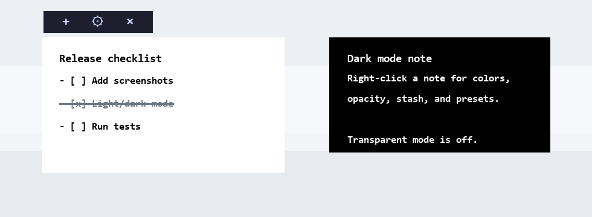
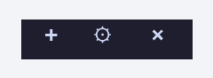

# Scrolly Polly Notely

[](https://github.com/cmm219/ScrollyPollyNotely-public/actions/workflows/ci.yml)

Scrolly Polly Notely is a small Windows-friendly floating notes app built with Python and Tkinter. It supports always-on-top notes, quick text capture, colors, opacity, resizing, checklists, presets, stash, and pasted images.

## Status

This is the public v1 release. The app is intentionally small: no installer, no account, no cloud sync, and no telemetry.

## Screenshots





## Install

1. Install Python 3.11 or newer from [python.org](https://www.python.org/downloads/).
2. Download this project from GitHub as a ZIP, or clone it with Git.
3. Open PowerShell in the project folder.
4. Install the image dependency:

```powershell
python -m pip install -r requirements.txt
```

## Run

```powershell
python labels.py
```

The small hub appears near the top-left of the screen. Use `+` to create a note, the gear for defaults, and `x` to save the current session and quit.

## Note Appearance

Right-click any note to change its appearance:

- `Light mode` sets a white background and black text.
- `Dark mode` sets a black background and white text.
- Both light and dark mode turn transparent background off for that note.
- The note's colors are saved and restored on restart.

The gear menu includes `Default light mode` and `Default dark mode`. These defaults apply to new notes; existing notes keep their own colors unless changed from the note's right-click menu.

## Checklists

Checklist lines use plain text syntax:

```text
- [ ] unchecked item
- [x] checked item
```

Click a checklist line to toggle it. Checked items are struck through, dimmed, and sorted below unchecked items. Numbered lists are plain text.

## Data Storage

Your notes and pasted images are stored outside the project folder:

```text
%APPDATA%\ScrollyPollyNotely\notes-and-settings.json
%APPDATA%\ScrollyPollyNotely\pasted-images\
```

That keeps downloaded code separate from each user's private notes.

For testing or portable use, set `SCROLLY_POLLY_NOTELY_DATA_DIR` before launching:

```powershell
$env:SCROLLY_POLLY_NOTELY_DATA_DIR = "C:\path\to\my-note-data"
python labels.py
```

## Send Clipboard Text

When the app is running, `send_label.ps1` sends the current clipboard text into a new note through the local socket listener:

```powershell
.\send_label.ps1
```

The default local port is `47210`. The socket binds to `127.0.0.1` only and does not accept remote network connections. The app does not make outbound network calls or send telemetry.

Advanced users can change `socket_port` in their config file.

If PowerShell blocks the helper script on a fresh Windows install, run it for the current process with:

```powershell
powershell -ExecutionPolicy Bypass -File .\send_label.ps1
```

## Start With Windows

One simple option is to create a shortcut in the Windows Startup folder:

```text
shell:startup
```

Point the shortcut at:

```text
pythonw.exe C:\path\to\ScrollyPollyNotely\labels.py
```

Use the full path to your installed Python `pythonw.exe` if Windows does not find it automatically.

## Uninstall

Delete the downloaded project folder. To remove your notes too, delete:

```text
%APPDATA%\ScrollyPollyNotely
```

## Development

Install test tooling if needed:

```powershell
python -m pip install pytest
python -m pytest
```

Some tests use Tkinter windows and may need a normal desktop session.

CI runs the same test command on Windows for pushes and pull requests. See [CHANGELOG.md](CHANGELOG.md) for release notes.
